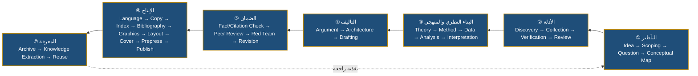

# المرحلة الأولى — ١. تحليل الأهداف وخريطة القدرات (Capability Map)

> المنهج: لم نبدأ بالوكلاء. بدأنا بالأهداف ← سلسلة القيمة ← القدرات ← الوظائف ← فرز (إنسان / وكيل / مهارة) ← ثم الوكلاء.
> المعادلة الحاكمة: **Role → Responsibility → Skill → Tool → Memory → Permission → Workflow → Handoff → Control → KPI**

---

## ١.١ تحليل الأهداف

| # | الهدف الاستراتيجي | ما يعنيه تشغيلياً | معيار النجاح |
|---|---|---|---|
| G1 | إنتاج معرفي رصين بصوت المؤلف | كتب ودراسات ومقالات بسجل فصيح وحجة متماسكة | اعتماد المؤلف من الجولة الأولى ≥ 70% للمخرجات الوسيطة |
| G2 | صفر تلفيق | كل مرجع وDOI واقتباس ورقم قابل للتتبع | 0 مراجع مختلقة بعد QG4 |
| G3 | سيادة المؤلف | الفكر والأطروحة والاعتماد والنشر للمؤلف | 100% من قرارات L4 بتوقيع المؤلف في السجل |
| G4 | عدم فقدان المعرفة | كل مشروع يغذي ما بعده | 100% من المشاريع المغلقة بأرشيف ودروس مرشحة |
| G5 | الاستمرارية | الاستئناف دون إعادة بناء السياق | زمن الاستئناف من `state.yaml` < دقيقتين |
| G6 | الكفاءة والكلفة المضبوطة | الحد الأدنى الكافي من الوكلاء والنماذج | الكلفة ضمن سقف المشروع، ونسبة أتمتة الروتين ≥ 60% في النموذج B |
| G7 | الاستقلال عن المزود | تبديل النماذج دون إعادة تصميم | تبديل مزود بتعديل ملف تكوين + اجتياز الانحدار |
| G8 | قابلية التطور | من استوديو شخصي إلى مركز أبحاث رقمي | انتقال A→B→C بإضافة وكلاء لا بإعادة البناء |

## ١.٢ تحليل سلسلة القيمة (موجز)

السلسلة الكاملة (٣٣ مرحلة) مفصّلة في [03-value-chain.md](03-value-chain.md). تجمّعت في **سبع حلقات قيمة**:

**نقاط الاختناق التاريخية في الإنتاج البحثي الفردي** (التي صُممت الوحدة لمعالجتها): ضياع السياق بين الجلسات، والمراجع غير المتحقق منها، وغياب المراجعة النقدية المستقلة قبل النشر، وتشتت المسودات والإصدارات، وعدم استخلاص الدروس.

## ١.٣ خريطة القدرات (Capability Map)

ثلاثة مستويات: **L0 مجال ← L1 قدرة ← L2 قدرة فرعية**، مع الجهة المنفذة.

| L0 المجال | L1 القدرة | L2 القدرات الفرعية | المنفّذ |
|---|---|---|---|
| **C1 القيادة والحوكمة** | C1.1 توجيه استراتيجي | برامج بحثية · محفظة · أولويات | AG-DIR + المؤلف |
| | C1.2 تنسيق وتشغيل | تصنيف الطلب · اختيار الوكلاء · سير العمل · الحالة | AG-ORC |
| | C1.3 حقوق القرار | L1–L4 · المجلس · التصعيد | governance/ |
| | C1.4 ضمان مستقل | بوابات QG0–QG7 · مشرفون خمسة | طبقة الضمان DEP-11 |
| **C2 التأطير البحثي** | C2.1 صياغة الإشكالية | سؤال رئيس/فرعي · نطاق · افتراضات | AG-RQA |
| | C2.2 الخرائط المفاهيمية | تعريفات عاملة · علاقات | SKL-CONCEPTMAP |
| **C3 الأدلة والمصادر** | C3.1 الاكتشاف | استعلامات قابلة للتكرار · ببليومترية | AG-DSC |
| | C3.2 التحقق | DOI · بيانات وصفية · سحب · هرم | AG-SRC |
| | C3.3 التركيب | مراجعة سردية/منهجية · فجوات | AG-LRV |
| | C3.4 الرصد المستمر | استعلامات مجدولة · توصيات | AG-WCH |
| **C4 النظرية والمنهج والتحليل** | C4.1 بناء الإطار | نظريات · نموذج مفاهيمي · إسهام | AG-THR |
| | C4.2 التصميم المنهجي | كمي/نوعي/مختلط/سببي | AG-MTH |
| | C4.3 التحليل | إحصاء · قياس · شبكات · محاكاة · نص | AG-DAT |
| | C4.4 السياسات والاستشراف | بدائل · سيناريوهات · منظومات · اقتصاد | AG-POL |
| | C4.5 خبرة المجال | السياسات الثقافية والهوية والتراث | AG-CUL |
| **C5 التأليف** | C5.1 عمارة العمل | قوس حجاجي · فصول · موازنة | AG-BKA |
| | C5.2 الصياغة | أكاديمي · فكري · سياساتي · رأي | AG-WRT |
| | C5.3 الترجمة | ذاكرة ترجمة · مسرد ثنائي | AG-TRN |
| | C5.4 التحقيق | OCR · مقابلة · تخريج | AG-TAH |
| **C6 الضمان العلمي** | C6.1 تدقيق الوقائع والاستشهاد | مطابقة ادعاء-مصدر · أرقام | AG-EVA |
| | C6.2 التحكيم | تحكيم أعمى | AG-PRV |
| | C6.3 الاختبار العدائي | تفنيد · تحيز · سببية | AG-RED |
| | C6.4 النزاهة والحقوق | انتحال · حقوق · إفصاح AI | AG-INT |
| **C7 التحرير** | C7.1 التحرير العلمي | بنية · حجاج · استجابة للتحكيم | AG-SED |
| | C7.2 التحرير اللغوي | نحو · أسلوب · مصطلح · Copy-edit | AG-ARE |
| **C8 النشر والإنتاج** | C8.1 الإخراج | PDF · EPUB · فهارس · ببليوغرافيا | AG-PUB |
| | C8.2 الأشكال | جداول · رسوم · هوية بصرية | AG-VIS |
| | C8.3 الغلاف والحقوق والإيداع | تنسيق مع بشر | AG-PUB + بشر |
| **C9 المعرفة** | C9.1 الأرشفة | checksums · إصدارات | AG-KNW + AG-VCS |
| | C9.2 الاستخلاص والترقية | دروس · قوالب · مصطلحات | AG-KNW |
| | C9.3 الاسترجاع (RAG) | فهرسة · بحث دلالي | AG-KNW + AG-AUT |
| **C10 التقنية والأمن والكلفة** | C10.1 الأتمتة | CI · مزامنة · استيعاب | AG-AUT |
| | C10.2 الأمن | RBAC · أسرار · سجلات وصول | AG-SEC |
| | C10.3 الكلفة | رموز · API · حدود | AG-CST |
| | C10.4 استقلال النموذج | محوّل · توجيه | runtime/rkpos/adapters |

## ١.٤ فرز الوظائف: إنسان أم وكيل أم مهارة؟

قاعدة الفرز (تُطبّق بالترتيب):

1. **هل الوظيفة سلطة فكرية أو قانونية أو مسؤولية نشر؟** ← إنسان (لا تفويض).
2. **هل تحتاج استقلالاً عن المنتِج (مراجعة/تحكيم/اعتماد)؟** ← وكيل مستقل (بنموذج مختلف إن أمكن).
3. **هل لها ذاكرة وصلاحيات ومخرجات وKPI مختلفة جوهرياً عن غيرها؟** ← وكيل.
4. **هل هي إجراء قابل لإعادة الاستخدام داخل أدوار متعددة؟** ← مهارة (Skill).
5. **هل هي حتمية بالكامل (لا تقدير فيها)؟** ← سكربت/أداة، لا وكيل ولا LLM.

| الوظيفة | القرار | التعليل |
|---|---|---|
| اعتماد العنوان والأطروحة والنشر | **إنسان (المؤلف)** | سلطة فكرية غير قابلة للتفويض |
| التحكيم الأكاديمي المعتبر للنشر الجامعي | **إنسان** + وكيل تمهيدي | الاعتراف الأكاديمي يتطلب أقراناً بشراً |
| البروفة النهائية للطباعة | **إنسان** + وكيل | مسؤولية الطباعة |
| الترجيح بين قراءات المخطوط | **إنسان (محقق)** | حكم علمي تراثي |
| تصميم الغلاف، العقود، ISBN | **إنسان** | حقوق إبداعية وقانونية |
| التحقق من DOI والبيانات الوصفية | **أداة + وكيل خفيف** | حتمي في جوهره (Crossref) مع تقدير في الحالات الحدّية |
| فحص الوسوم والاستشهادات | **سكربت** (`verify/claims.py`, `citations.py`) | حتمي |
| التنسيق وفق APA/Chicago | **أداة (CSL)** + مهارة | حتمي |
| الإصدارات والنسخ الاحتياطي | **سكربت/CI** (وكيل في B/C) | حتمي في MVP |
| حساب الكلفة | **سكربت** (وكيل في B/C) | حتمي |
| تدقيق الوقائع | **وكيل مستقل** | يحتاج فهماً واستقلالاً عن الكاتب |
| الفريق الأحمر | **وكيل مستقل** | استقلال جوهري |
| رسم الخرائط المفاهيمية | **مهارة** | تُستدعى من RQA وTHR وDIR |
| بناء السيناريوهات | **مهارة** داخل AG-POL | ليست دوراً مستقلاً |
| الإحصاء/Python/R/الشبكات/المحاكاة | **وكيل واحد بأوضاع** | الذاكرة والصلاحيات متطابقة |

## ١.٥ نقاط التكامل الحرجة بين الوكلاء

| نقطة التكامل | من ← إلى | ما يُنقل | الضابط |
|---|---|---|---|
| I1 الأدلة ← الكتابة | AG-LRV ← AG-WRT | بطاقات أدلة بـ Source_ID | لا استشهاد خارج MEM-SOURCE |
| I2 الكتابة ← التدقيق | AG-WRT ← AG-EVA | مسودة موسومة | claims.audit + citations.audit |
| I3 التدقيق ← النزاهة | AG-EVA ← AG-INT | سجل ادعاءات محكوم | QG4 |
| I4 التحرير ← الإنتاج | AG-ARE ← AG-PUB | نص معتمد + checksum | QG5 + L4 |
| I5 الإنتاج ← المعرفة | AG-PUB ← AG-KNW | حزمة نشر + سجلات | QG7 |
| I6 الرصد ← المصادر | AG-WCH ← AG-SRC | مرشحات جديدة | لا تعديل تلقائي للمخطوط |
| I7 كل وكيل ← المنسق | ALL ← AG-ORC | RESULT/ESCALATION | بروتوكول الرسائل |
