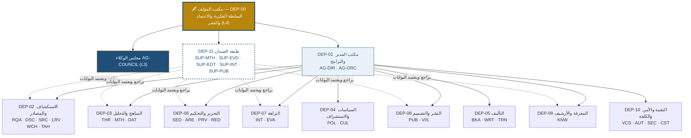
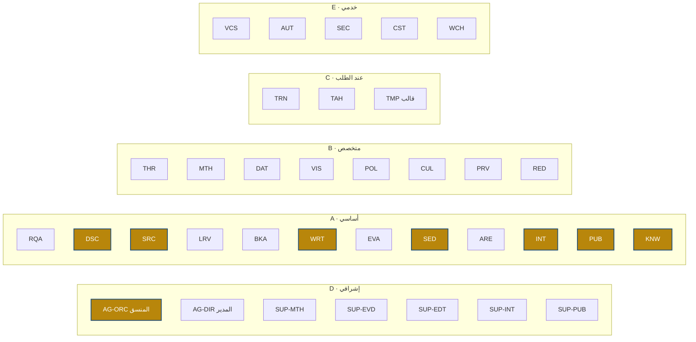

# المرحلة الأولى — ٢. الهيكل التنظيمي الأمثل

## ٢.١ من ستة عشر قطاعاً إلى إحدى عشرة إدارة

دُمجت القطاعات المقترحة وفق قاعدة: **تُدمج الوحدتان إذا تطابقت ذاكرتهما وأدواتهما ومستهلكو مخرجاتهما**، وتُفصلان إذا كان الفصل شرطاً للاستقلال الرقابي.

| القطاع المقترح | الإدارة المعتمدة | سبب الدمج/الفصل |
|---|---|---|
| ١ مكتب المدير · ٢ الاستراتيجية والبرامج · ١٣ إدارة المشاريع | **DEP-01** مكتب المدير والبرامج وإدارة المشاريع | سلسلة قرار واحدة من البرنامج إلى المهمة |
| ٣ الاستكشاف والمراجعات · ٩ التوثيق والمصادر | **DEP-02** الاستكشاف العلمي والمصادر | الذاكرة نفسها (MEM-SOURCE/RESEARCH) |
| ٤ الدراسات والمنهجيات · ٥ البيانات والتحليل | **DEP-03** المناهج والتحليل | التصميم والتحليل حلقة واحدة |
| ٦ الدراسات المستقبلية والسياسات | **DEP-04** السياسات والاستشراف | يبقى مستقلاً لخصوصية مناهجه |
| ٧ التأليف والكتابة | **DEP-05** التأليف | — |
| ٨ التحرير والتحكيم | **DEP-06** التحرير والتحكيم | — |
| ١٠ النزاهة والملكية الفكرية | **DEP-07** النزاهة | منفصلة عن التحرير لضمان الاستقلال |
| ١١ النشر والإنتاج · ١٢ التصميم والإخراج | **DEP-08** النشر والإنتاج والتصميم | خط إنتاج واحد |
| ١٤ الأرشيف وإدارة المعرفة | **DEP-09** المعرفة والأرشيف | — |
| ١٥ التقنية والأتمتة · ١٦ (الشق التقني) | **DEP-10** التقنية والأمن والكلفة | — |
| ١٦ (الشق الرقابي) | **DEP-11** طبقة الضمان الإشرافية | **مستقلة** تتبع المؤلف مباشرة |

## ٢.٢ المخطط التنظيمي (Organizational Chart)

> **مبدأ الفصل:** طبقة الضمان لا تتبع مكتب المدير ولا المنسق؛ ترفع مباشرة إلى المؤلف. هذا يمنع أن يعتمد المنتِج عمله.

## ٢.٣ الخريطة الوظيفية (Functional Map)

| الإدارة | الوظائف | المخرجات الرئيسة | البوابة التي تخدمها |
|---|---|---|---|
| DEP-01 | التخطيط · التنسيق · الحالة · المحفظة · المجلس (أمانة) | manifest · plan · state · decisions | QG0 · QG7 |
| DEP-02 | الإشكالية · الاكتشاف · التحقق · المراجعة · الرصد · التحقيق | scope · sources.jsonl · literature_review · evidence_cards | QG0 · QG1 |
| DEP-03 | الإطار · المنهج · التحليل | framework · methods_plan · analysis_report | QG2 |
| DEP-04 | السياسات · الاستشراف · خبرة المجال | policy_analysis · scenarios · domain_review | QG2 · QG3 |
| DEP-05 | العمارة · الصياغة · الترجمة | outline · drafts · translation | QG3 |
| DEP-06 | التحرير العلمي واللغوي · التحكيم · الفريق الأحمر | edited · review_log · red_team · peer_review | QG3 · QG5 |
| DEP-07 | تدقيق الوقائع · النزاهة · الحقوق | fact_audit · integrity_report · rights_register | QG4 |
| DEP-08 | الإخراج · الأشكال · الغلاف | book.pdf · book.epub · figures · metadata | QG6 |
| DEP-09 | الأرشفة · الاستخلاص · RAG | archive · lessons · kb_candidates | QG7 |
| DEP-10 | الأتمتة · الأمن · الكلفة · الإصدارات | CI · security_report · cost_report · tags | — |
| DEP-11 | الاعتماد المستقل للبوابات | gate decisions | QG1–QG7 |

## ٢.٤ خريطة الوكلاء (Agent Map)

السجل الكامل بكل وكيل في [04-agent-registry.md](04-agent-registry.md)، والعلاقات التفصيلية في [../phase-2/handoff-matrix.md](../phase-2/handoff-matrix.md).
