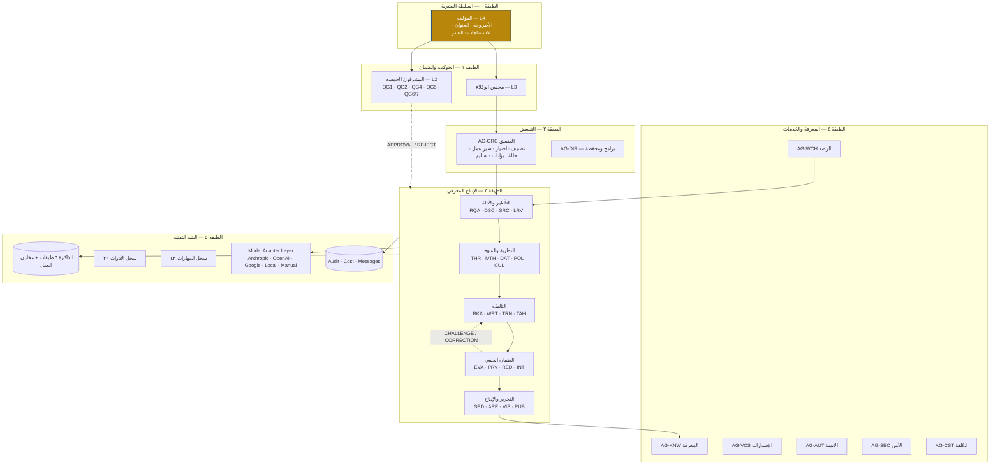

# المرحلة الأولى — ٦. مخطط معمارية الوكلاء (Agent Architecture Diagram) — الإصدار الأول

## ٦.١ المعمارية الطبقية

## ٦.٢ تدفق التحكم والبيانات

| القناة | النوع | المخطط | الحامل |
|---|---|---|---|
| المهام | TASK → RESULT | `message.schema.json` | `projects/<PID>/messages/messages.jsonl` |
| التسليم | HANDOFF | `handoff.schema.json` | `messages/handoffs.jsonl` |
| الاعتراض | CHALLENGE / CORRECTION (بدليل إلزامي) | `message.schema.json` | idem |
| الاعتماد | APPROVAL / REJECT | `gate_decision.schema.json` | `reviews/gate_*.yaml` |
| التصعيد | ESCALATION | `message.schema.json` | idem + Decision Brief |
| القرارات | DC-xxx | `decisions.yaml` | المشروع |
| الأثر | Audit | `audit.schema.json` | `logs/audit.jsonl` |

## ٦.٣ قواعد المعمارية غير القابلة للكسر (مفروضة آلياً في `rkpos validate`)

1. لا وكيل يكتب في `MEM-INSTITUTIONAL` أو `MEM-AUTHOR`.
2. `MEM-SOURCE` يكتبه `AG-SRC` وحده.
3. لا وكيل يكتب في `ST-APPROVED`؛ النقل إليه أمر بشري (`rkpos complete --approved-file` بصفة `HUMAN-AUTHOR`).
4. المشرفون لا يكتبون في مخازن المحتوى (`ST-DRAFT/EDITED/APPROVED`).
5. المراجعون المستقلون (EVA · PRV · RED · SUP-*) على فئة `T4-independent`.
6. كل إرسال (X → Y) يقابله قبول عند Y (تبادلية التسليم).
7. كل خطوة L4 في سير العمل تحمل `human_approval: true`؛ وQG0 وQG6 من مستوى L4.
8. الملفات المولدة مطابقة للمصدر `agents/_specs/`.
