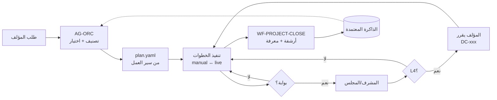

# المرحلة الأولى — ٨. نموذج التشغيل المستهدف (Target Operating Model) ونماذج التشغيل الثلاثة

## ٨.١ نموذج التشغيل المستهدف — المكوّنات الستة

| المكوّن | التصميم المعتمد |
|---|---|
| **الأفراد** | المؤلف (سلطة L4) + مشرف تقني (قد يكون المؤلف في A) + بشر عند الحاجة: مدقق بروفة، محكّمون، مصمم، مستشار حقوق، محقق تراثي |
| **العمليات** | ١٩ سير عمل معرّفاً (`workflows/`) تُوسَّع آلياً إلى خطة مشروع؛ دورة الفصل قابلة لإعادة الاستخدام |
| **الحوكمة** | L1–L4 · مجلس · ٥ مشرفين · ٨ بوابات · بروتوكول نزاع · تعلم منضبط |
| **المعلومات** | ٦ طبقات ذاكرة + ١٨ مخزن عمل؛ مخططات JSON لكل كيان؛ سجل تدقيق إلحاقي |
| **التقنية** | GitHub (المصدر الوحيد للحقيقة) · Drive (التعاون) · Zotero (المراجع) · Model Adapter Layer · RAG · CI |
| **القياس** | KPIs لكل وكيل + إطار مؤشرات للوحدة + لوحة قيادة |

## ٨.٢ نماذج التشغيل الثلاثة

| البعد | **A — Personal Research Studio** | **B — Professional Research Department** | **C — Digital Think Tank** |
|---|---|---|---|
| الغاية | مؤلف واحد، مشروع أو اثنان متوازيان | عدة كتب ودراسات متوازية | مركز أبحاث رقمي ببرامج ورصد مستمر |
| عدد الوكلاء المفعّلين | **8** (MVP) | **13 أساساً** + المتخصصون حسب المشروع (≈ 18–24) | **17 أساساً** + الطبقة الإشرافية الكاملة (≈ 30–35) |
| المجلس | المؤلف مباشرة | مجلس رقمي + المؤلف | مجلس رقمي دائم + محكمون بشريون |
| الإشراف | داخل وكلاء MVP بمهارات | المشرفون عند البوابات المهمة | الطبقة الإشرافية الخماسية دائماً |
| التقنية | المستودع + محادثة Claude (يدوي) + Crossref | + مفاتيح API لمزودين + Zotero + Pandoc + CI | + قاعدة متجهات + PostgreSQL + رصد مجدول + لوحة حية |
| تشغيل النماذج | يدوي (لصق) أو API واحد | API مزودين (كتابة ≠ مراجعة) | توجيه كامل + نماذج محلية لـ AUTHOR_ONLY |
| الكلفة التقديرية | منخفضة (اشتراك محادثة أو API محدود) | متوسطة: API + Zotero + استضافة خفيفة | أعلى: API بحجم + قواعد بيانات + فحص تشابه + بشر |
| التعقيد | منخفض | متوسط | مرتفع |
| الأمان | أساسي: مستودع خاص، لا أسرار في git | RBAC للوكلاء + فحص أسرار + نسخ احتياطي | + تشفير AUTHOR_ONLY + سجلات وصول + مراجعة دورية |
| جودة البحث | جيدة مع انضباط المؤلف؛ المراجعة غير مستقلة كلياً | عالية: مراجعة مستقلة النموذج + بوابات | الأعلى: تحكيم بشري + رصد + مجلس دائم |
| قابلية التوسع | محدودة | جيدة | عالية |
| الاستعداد | **جاهز الآن** | بعد Phase 3–5 | بعد Phase 6–7 |

> الكلفة هنا نوعية متعمدة؛ النموذج الكمي بافتراضات قابلة للتعديل في [../phase-5/cost-model.md](../phase-5/cost-model.md).

## ٨.٣ مسار الانتقال
A → B: تفعيل مزود ثانٍ + Zotero + Pandoc + تشغيل `--live` + تفعيل `AG-LRV, AG-EVA, AG-ARE, AG-VCS, AG-CST`.
B → C: قاعدة متجهات + `AG-WCH` المجدول + `AG-SEC, AG-AUT` + الطبقة الإشرافية الدائمة + محكمون بشريون.
لا يتطلب أي انتقال إعادة تصميم: تغيير `--model` عند فتح المشروع وتفعيل الموصلات فقط.
