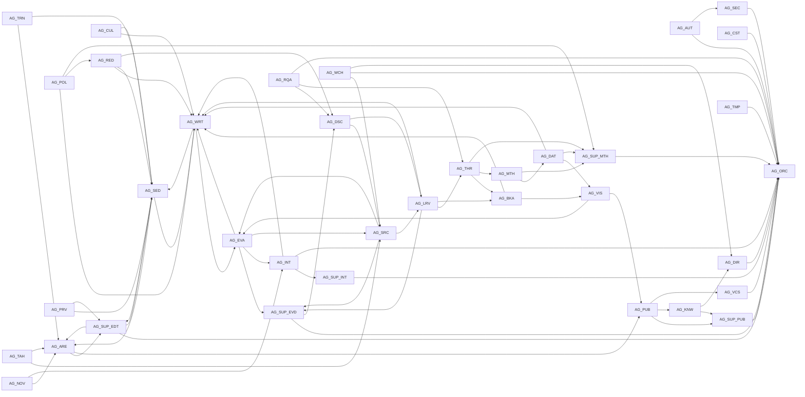

<!-- GENERATED by `rkpos generate` — do not edit by hand. -->
# مصفوفة التسليم — Handoff Matrix

| من | إلى | استشارة | تصعيد | البديل |
|---|---|---|---|---|
| `AG-ARE` | AG-SUP-EDT, AG-PUB | AG-CUL | AG-SUP-EDT(L2) | AG-SED |
| `AG-AUT` | AG-ORC, AG-SEC | AG-SEC | AG-ORC(L2) | HUMAN-TECH |
| `AG-BKA` | AG-WRT, AG-COUNCIL, AG-VIS | AG-RED | AG-SUP-EVD(L2) | AG-ORC |
| `AG-CST` | AG-ORC, HUMAN-AUTHOR | — | AG-ORC(L2), HUMAN-AUTHOR(L4) | AG-ORC |
| `AG-CUL` | AG-WRT, AG-SED, AG-COUNCIL | AG-DSC | HUMAN-AUTHOR(L4) | AG-POL |
| `AG-DAT` | AG-VIS, AG-SUP-MTH, AG-WRT | AG-MTH | HUMAN-AUTHOR(L4) | AG-MTH |
| `AG-DIR` | AG-ORC, AG-COUNCIL, HUMAN-AUTHOR | AG-CUL, AG-DSC | HUMAN-AUTHOR(L4) | AG-ORC |
| `AG-DSC` | AG-SRC, AG-LRV | AG-RQA | AG-ORC(L2) | AG-LRV |
| `AG-EVA` | AG-WRT, AG-SUP-EVD, AG-INT, AG-SRC | AG-DAT | AG-SUP-INT(L2) | AG-INT |
| `AG-INT` | AG-SUP-INT, AG-WRT, AG-ORC, HUMAN-AUTHOR | AG-SRC | HUMAN-AUTHOR(L4) | HUMAN-AUTHOR |
| `AG-KNW` | AG-SUP-PUB, AG-DIR, HUMAN-AUTHOR | AG-SEC | HUMAN-AUTHOR(L4) | AG-VCS |
| `AG-LRV` | AG-THR, AG-BKA, AG-SUP-EVD, AG-WRT | AG-MTH | HUMAN-AUTHOR(L4) | AG-DSC |
| `AG-MTH` | AG-DAT, AG-SUP-MTH | AG-DAT | HUMAN-AUTHOR(L4) | AG-SUP-MTH |
| `AG-NOV` | AG-ARE, AG-INT | AG-CUL, AG-TAH | HUMAN-AUTHOR(L4) | HUMAN-AUTHOR |
| `AG-ORC` | ALL | AG-DIR, AG-CST, AG-SUP-MTH | AG-COUNCIL(L3), HUMAN-AUTHOR(L4) | HUMAN-AUTHOR |
| `AG-POL` | AG-WRT, AG-RED, AG-SUP-MTH | AG-CUL, AG-DAT | HUMAN-AUTHOR(L4) | AG-CUL |
| `AG-PRV` | AG-SED, AG-SUP-EDT | — | AG-COUNCIL(L3) | AG-RED |
| `AG-PUB` | AG-SUP-PUB, AG-KNW, AG-VCS | AG-VIS | AG-ORC(L2) | HUMAN-AUTHOR |
| `AG-RED` | AG-WRT, AG-SED, AG-COUNCIL, AG-DSC | AG-DSC | AG-COUNCIL(L3) | AG-PRV |
| `AG-RQA` | AG-DSC, AG-THR, AG-ORC | AG-CUL, AG-MTH | AG-ORC(L2) | AG-ORC |
| `AG-SEC` | AG-ORC, HUMAN-AUTHOR, HUMAN-TECH | — | HUMAN-AUTHOR(L4) | HUMAN-TECH |
| `AG-SED` | AG-ARE, AG-WRT, AG-SUP-EDT | AG-THR | AG-COUNCIL(L3) | AG-ARE |
| `AG-SRC` | AG-LRV, AG-EVA, AG-SUP-EVD | AG-TAH | AG-SUP-EVD(L2) | HUMAN-AUTHOR |
| `AG-SUP-EDT` | AG-ORC, AG-SED, AG-ARE, AG-COUNCIL | AG-CUL | HUMAN-AUTHOR(L4) | HUMAN-AUTHOR |
| `AG-SUP-EVD` | AG-ORC, AG-DSC, AG-COUNCIL | AG-SRC | HUMAN-AUTHOR(L4) | HUMAN-AUTHOR |
| `AG-SUP-INT` | AG-ORC, AG-COUNCIL, HUMAN-AUTHOR | AG-SRC | HUMAN-AUTHOR(L4) | HUMAN-AUTHOR |
| `AG-SUP-MTH` | AG-ORC, AG-COUNCIL | AG-DAT | AG-COUNCIL(L3) | HUMAN-AUTHOR |
| `AG-SUP-PUB` | AG-ORC, HUMAN-AUTHOR | — | HUMAN-AUTHOR(L4) | HUMAN-AUTHOR |
| `AG-TAH` | AG-SRC, AG-ARE, HUMAN-AUTHOR | — | HUMAN-AUTHOR(L4) | HUMAN-AUTHOR |
| `AG-THR` | AG-BKA, AG-MTH, AG-SUP-MTH | AG-CUL | HUMAN-AUTHOR(L4) | AG-LRV |
| `AG-TMP` | AG-ORC | — | AG-ORC(L2) | AG-ORC |
| `AG-TRN` | AG-ARE, AG-SED | AG-CUL | HUMAN-AUTHOR(L4) | HUMAN-AUTHOR |
| `AG-VCS` | AG-ORC | — | AG-ORC(L2) | HUMAN-AUTHOR |
| `AG-VIS` | AG-PUB, AG-EVA | — | AG-SUP-MTH(L2) | AG-PUB |
| `AG-WCH` | AG-SRC, AG-ORC, AG-DIR | — | AG-ORC(L2) | AG-DSC |
| `AG-WRT` | AG-EVA, AG-SED | AG-THR, AG-CUL, AG-DAT | HUMAN-AUTHOR(L4) | HUMAN-AUTHOR |

## مخطط علاقات التسليم (Mermaid)

