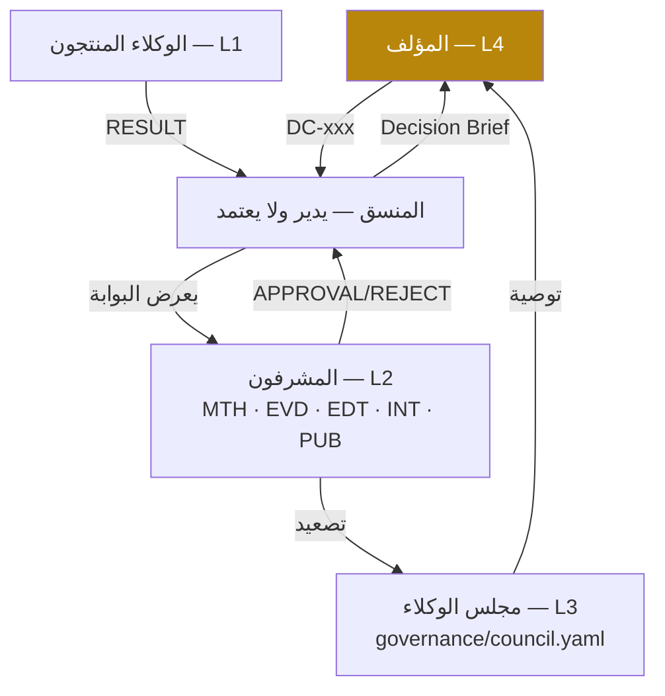

# المرحلة الثالثة — هندسة الحوكمة وسير العمل

## ٣.١ نموذج الحوكمة

**القاعدة الحاكمة:** *AI proposes — system verifies — human author decides.*

| الركيزة | الوثيقة/الملف | الفرض الآلي |
|---|---|---|
| حقوق القرار L1–L4 | [`governance/decision_rights.yaml`](../../governance/decision_rights.yaml) | `runner.complete` يمنع غير المؤلف من L4 |
| مجلس الوكلاء | [`governance/council.yaml`](../../governance/council.yaml) | قالب المحضر + الاستقلال |
| بوابات الجودة | [`governance/quality_gates.yaml`](../../governance/quality_gates.yaml) | `gates.record` يرفض اعتماد بوابة بمعايير فاشلة إلا من المؤلف، ويرفض معتمِداً غير مخول |
| هرم المصادر | [`governance/source_hierarchy.yaml`](../../governance/source_hierarchy.yaml) | `gates.auto_checks("QG1")` |
| تصنيف البيانات | [`governance/data_classification.yaml`](../../governance/data_classification.yaml) | `scripts/security_scan.py` |
| الفريق الأحمر | [`governance/red_team_protocol.md`](../../governance/red_team_protocol.md) | `WF-CHAPTER-CYCLE` C3 |
| حل النزاع | [`governance/conflict_resolution.md`](../../governance/conflict_resolution.md) | `WF-CONFLICT-RESOLUTION` |
| الدستور المشترك | [`prompts/constitution.md`](../../prompts/constitution.md) | يُلحق بكل برومبت |

## ٣.٢ حقوق القرار (ملخص)

| المستوى | أمثلة | المعتمد | السجل |
|---|---|---|---|
| **L4** | العنوان · الأطروحة · الاستنتاجات الجوهرية · حذف/إضافة فصل · إضافة نظرية · النشر · الهيكل · ترقية المعرفة · وكيل مؤقت · منح صلاحية · مادة محمية · موقف جديد للمؤلف · اعتماد برومبت/نموذج جديد | المؤلف | `decisions.yaml` (DC-xxx) |
| **L3** | تقييم الفكرة · مراجعة الهيكل/المنهج/الحجج/النتائج/النسخة النهائية · نزاع غير محسوم · QG3 | المجلس | محضر المجلس |
| **L2** | QG1 · QG2 · QG4 · QG5 · QG7 · مصدر NOT_VERIFIABLE غير مركزي · إعادة إسناد · إغلاق ملاحظة بالتعديل | المشرف | `reviews/gate_*.yaml` |
| **L1** | التنسيق · إعادة محاولة أداة · تنظيف المراجع · تحديث الحالة | الوكيل | `audit.jsonl` |

## ٣.٣ بوابات الجودة QG0–QG7

| البوابة | السؤال | المنتج | المعتمد | مستوى | فحوص آلية |
|---|---|---|---|---|---|
| QG0 | هل المشروع محدد؟ | AG-RQA | المؤلف | L4 | مخطط البيان؛ عدد الأسئلة |
| QG1 | هل المصادر كافية وموثوقة؟ | AG-LRV | SUP-EVD | L2 | ≥95% VERIFIED · Tier1-2 ≥70% · صفر FAILED/RETRACTED |
| QG2 | هل المنهج صحيح؟ | AG-MTH | SUP-MTH | L2 | — |
| QG3 | هل الاستدلال متماسك؟ | AG-WRT | المجلس | L3 | وسم 100% · لا تحديات حرجة مفتوحة |
| QG4 | هل توجد مشكلات نزاهة/استشهاد؟ | AG-INT | SUP-INT | L2 | الاستشهادات تُحل لمصادر متحققة · لا DOI غير متحقق |
| QG5 | هل النص جاهز تحريرياً؟ | AG-ARE | SUP-EDT | L2 | المسرد |
| QG6 | هل الملفات جاهزة للنشر؟ | AG-PUB | SUP-PUB + المؤلف | L4 | checksum · EPUBCheck |
| QG7 | هل حُفظ المشروع كاملاً؟ | AG-KNW | SUP-PUB | L2 | الأرشيف والنسخ |

## ٣.٤ النزاهة العلمية وهندسة الاستشهاد

- **Zero Fabrication** مفروضة في ثلاث طبقات: الدستور (السلوك) ← المخططات (`source.schema.json` يرفض DOI بلا دليل تحقق؛ `claim.schema.json` يرفض FACT/EBI بلا مصدر) ← الفحوص (`verify/*`).
- **وسوم الادعاءات** `[FACT] [EBI] [INTERP] [HYP] [AUTHOR]` في كل مسودة؛ تُزال آلياً في نسخة الإخراج فقط.
- **الاستشهاد في المسودات بمفتاح المعرّف** `[@SRC-000123, p. 45]` — قابل للفحص الآلي، ويُنسَّق APA 7 افتراضياً (أو Chicago/Harvard/MLA) عبر CSL عند الإخراج.
- **قاعدة المراجع المركزية:** `MEM-SOURCE` (`knowledge-base/sources/sources.jsonl`) متزامنة مع Zotero؛ يكتبها `AG-SRC` وحده.

## ٣.٥ الإصدارات وسجل التدقيق

| الإصدار | الحالة | من يرفعه |
|---|---|---|
| v0.1 | Draft | الوكلاء |
| v0.5 | Reviewed | بعد QG3 |
| v0.8 | Edited | بعد QG5 |
| v0.9 | Approved | **المؤلف** |
| v1.0 | Published | **المؤلف** (وسم `RKP-YYYY-NNNN-v1.0` يطلق `release.yml`) |

كل تعديل رئيس في `projects/<PID>/CHANGELOG.md`؛ كل فعل في `logs/audit.jsonl` بالحقول: `ACTION_ID · AGENT · DATE · PROJECT · ACTION · FILES_CHANGED · SOURCE_USED · DECISION · APPROVAL` (+ `DECISION_LEVEL · MODEL · COST_USD`).

## ٣.٦ الإنسان في الحلقة والتعلم المنضبط

- لا اعتماد نهائي آلي لأي قرار فكري جوهري.
- الوكلاء لا يعدّلون برومبتاتهم؛ يقترحون في `logs/agent_improvement_log.jsonl` (قالب `templates/agent_improvement.template.json`) ← `WF-AGENT-CHANGE`: فرع ← اختبارات انحدار ← فحص أمني ← موافقة L4 ← دمج ورفع الإصدار.
- **الوكيل المفقود** (`WF-MISSING-AGENT`): مهارة؟ ← وكيل قائم؟ ← وكيل مؤقت من `AG-TMP` بموافقة L4 وتاريخ انتهاء ← تقييم الاستدامة عند الإغلاق.
- **الرصد المستمر** (`WF-RESEARCH-WATCH`): تسجيل ← تحقق ← تصنيف ← ربط ← **لا تعديل تلقائي** ← توصية.

## ٣.٧ مكتبة سير العمل

| المعرّف | النوع | الحد الأدنى لنموذج التشغيل |
|---|---|---|
| [WF-BOOK-PRODUCTION](../../workflows/WF-BOOK-PRODUCTION.yaml) | السلسلة الرئيسة للكتاب | A |
| [WF-BOOK-INTELLECTUAL](../../workflows/WF-BOOK-INTELLECTUAL.yaml) | ١ كتاب فكري | A |
| [WF-BOOK-ACADEMIC](../../workflows/WF-BOOK-ACADEMIC.yaml) | ٢ كتاب أكاديمي | B |
| [WF-POLICY-STUDY](../../workflows/WF-POLICY-STUDY.yaml) | ٣ دراسة سياسات | B |
| [WF-SYSTEMATIC-REVIEW](../../workflows/WF-SYSTEMATIC-REVIEW.yaml) | ٤ مراجعة منهجية | B |
| [WF-LIT-REVIEW](../../workflows/WF-LIT-REVIEW.yaml) | ٥ مراجعة أدبيات | A |
| [WF-FORESIGHT](../../workflows/WF-FORESIGHT.yaml) | ٦ دراسة مستقبلية | B |
| [WF-CRITICAL-EDITION](../../workflows/WF-CRITICAL-EDITION.yaml) | ٧ تحقيق مخطوط | C |
| [WF-JOURNAL-ARTICLE](../../workflows/WF-JOURNAL-ARTICLE.yaml) | ٨ مقال علمي | A |
| [WF-OPED](../../workflows/WF-OPED.yaml) | ٩ مقال رأي | A |
| [WF-STRATEGIC-REPORT](../../workflows/WF-STRATEGIC-REPORT.yaml) | ١٠ تقرير استراتيجي | B |
| [WF-TRANSLATION](../../workflows/WF-TRANSLATION.yaml) | ١١ إصدار مترجم | B |
| [WF-REEDITION](../../workflows/WF-REEDITION.yaml) | ١٢ إعادة تحرير | A |
| [WF-CHAPTER-CYCLE](../../workflows/WF-CHAPTER-CYCLE.yaml) | دورة الفصل (فرعي) | — |
| [WF-PROJECT-CLOSE](../../workflows/WF-PROJECT-CLOSE.yaml) | الإغلاق وعدم فقدان المعرفة | — |
| [WF-RESEARCH-WATCH](../../workflows/WF-RESEARCH-WATCH.yaml) | الرصد المستمر | C |
| [WF-CONFLICT-RESOLUTION](../../workflows/WF-CONFLICT-RESOLUTION.yaml) | حل النزاع | — |
| [WF-AGENT-CHANGE](../../workflows/WF-AGENT-CHANGE.yaml) | اعتماد تغيير وكيل | — |
| [WF-MISSING-AGENT](../../workflows/WF-MISSING-AGENT.yaml) | الوكيل المفقود | — |

صيغة كل خطوة: `id · stage · agent · reviewer · task · skills · inputs · outputs · gate · decision_level · human_approval · optional_if · on_fail`، أو `uses` لسير عمل فرعي مع `foreach`. التوسيع إلى خطة المشروع: `runtime/rkpos/workflow.py`.
