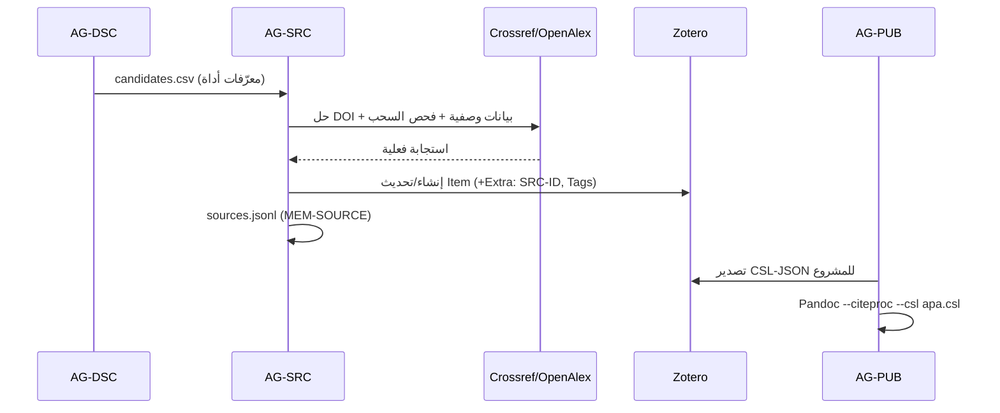

# المرحلة الرابعة — معمارية Google Drive وZotero

## ٤.١ Google Drive

```
Research Unit/
├── Active Projects/
│   └── RKP-2026-0001 — حوكمة الذكاء الاصطناعي في القطاع الثقافي/
│       ├── 00 Manifest & Decisions   (نسخ للقراءة من المستودع)
│       ├── 10 Review Drafts          (Google Docs للتعليق والاقتراحات)
│       └── 90 Author Inbox           (ما ينتظر قرار المؤلف)
├── Research Sources/                 (PDFs مرخصة الاستعمال؛ مرآة لمرفقات Zotero)
├── Manuscripts/                      (النسخ المعتمدة v0.9 للقراءة)
├── Data/                             (CONFIDENTIAL — مشاركة مقيدة)
├── Reviews/                          (تقارير التحكيم البشري الخارجي)
├── Publishing/                       (حزم الطباعة، الغلاف، عقود — بشري)
├── Published Works/                  (v1.0)
└── Archive/                          (لقطات أسبوعية مشفرة)
```

| القاعدة | التفصيل |
|---|---|
| الاتجاه | المستودع → Drive للمراجعة البشرية؛ Drive → المستودع فقط عبر `rkpos record-output` أو PR (لا مزامنة عكسية صامتة) |
| التعليقات | ملاحظات المؤلف في Google Docs تُستورد إلى `reviews/author_comments_chNN.md` قبل التحرير التالي |
| الحساسية | `AUTHOR_ONLY` لا يُرفع إلى مجلد مشترك؛ `CONFIDENTIAL` بمشاركة مسماة فقط |
| التنفيذ | موصل Google في Claude (قراءة/إنشاء/تحديث) أو OAuth برمجي (`GOOGLE_OAUTH_*`) — يحتاج تفعيلاً |

## ٤.٢ Zotero — المصدر المرجعي الرئيس

| العنصر في Zotero | المقابل في المنظومة |
|---|---|
| Library (user/group) | `ZOTERO_LIBRARY_ID/TYPE` |
| Collection لكل مشروع | `RKP-YYYY-NNNN` + مجموعات فرعية لكل فصل |
| Item Key | `Zotero_Key` في سجل المصدر |
| حقل Extra | `SRC-000123` (الربط العكسي) + `verification: VERIFIED@2026-10-07` |
| Tags | `tier:1` · `status:VERIFIED` · `used:ch03` · `retracted` |
| Notes | ملاحظات الاستخلاص (evidence cards) مختصرة |
| Attachments | PDFs (مرآة في Drive/Research Sources) |
| Export CSL-JSON | `projects/<PID>/research/references.json` لبناء الببليوغرافيا |

**التدفق:**


**قواعد:** `AG-SRC` وحده يكتب في Zotero · لا عنصر بلا تحقق · العنصر المسحوب يُوسم ولا يُحذف · الحالة بلا Zotero: `sources.jsonl` المحلي يعمل وحده (fallback مسجل في سجل الأدوات).
