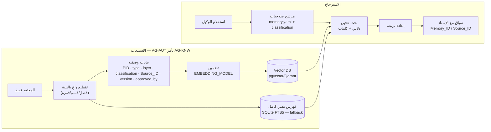

# المرحلة الرابعة — قاعدة المعرفة والذاكرة وRAG

## ٤.١ الطبقات الست للذاكرة

| الطبقة | المضمون | المسار | التصنيف | من يكتب |
|---|---|---|---|---|
| MEM-AUTHOR | الأسلوب · المصطلحات · الاختيارات الفكرية · المواقف المعتمدة | `memory/author/` | AUTHOR_ONLY | المؤلف فقط (أو ترقية L4) |
| MEM-PROJECT | قرارات المشروع والأطروحة والنطاق | `projects/<PID>/memory/` | CONFIDENTIAL | ORC · DIR · RQA |
| MEM-RESEARCH | مفاهيم · نظريات · ملخصات | `knowledge-base/research/` | INTERNAL | KNW بعد الاعتماد |
| MEM-SOURCE | سجل المصادر | `knowledge-base/sources/sources.jsonl` | INTERNAL | SRC وحده |
| MEM-EDITORIAL | قرارات التحرير · المسرد · دليل الأسلوب | `knowledge-base/editorial/` | INTERNAL | SED؛ المسرد بموافقة المؤلف |
| MEM-INSTITUTIONAL | سياسات · ممارسات · دروس معتمدة | `knowledge-base/institutional/` | INTERNAL | **ترقية L4 فقط** |

الصلاحيات الفعلية لكل وكيل: [مصفوفة الذاكرة](../phase-2/memory-matrix.md). كل عنصر يحمل حقول `schemas/memory_item.schema.json`:
`Memory_ID · Type · Layer · Project · Created_By · Created_Date · Verified · Confidence · Source · Version · Access_Level · Expiry · Approved_By · Content · Tags`
والمخطط **يرفض** أي عنصر في الطبقة المؤسسية أو طبقة المؤلف دون `Approved_By: HUMAN-AUTHOR`.

## ٤.٢ قاعدة عدم فقدان المعرفة

عند الإغلاق (`WF-PROJECT-CLOSE`) يستخلص `AG-KNW` ثماني فئات: **القرارات · المناهج · أفضل المصادر · الأخطاء · الدروس · القوالب · المصطلحات · التحسينات** ← `ST-KB-CANDIDATES` ← مراجعة مشرف ← اعتماد المؤلف ← `rkpos memory-promote` ← إعادة الفهرسة.

## ٤.٣ مكوّنات قاعدة المعرفة

| المكوّن | المصدر | الصيغة |
|---|---|---|
| الكتب والمقالات السابقة للمؤلف | النسخ المنشورة | Markdown مقسّم + بيانات وصفية |
| الأفكار والملاحظات | Obsidian / PKC (MajLib) | Markdown بروابط |
| الاقتباسات الموثقة | بطاقات الأدلة | JSONL بـ Source_ID وموضع |
| الخرائط المفاهيمية | المشاريع | Mermaid / YAML |
| النظريات والمفاهيم | MEM-RESEARCH | عناصر ذاكرة |
| المسودات والأبحاث السابقة | الأرشيف | Markdown + إصدارات |

## ٤.٤ معمارية RAG (RAG + Metadata + Semantic Search)

| القاعدة | التنفيذ |
|---|---|
| **المرشح الأمني قبل البحث** | الاستعلام يُقيَّد بطبقات `memory.read` للوكيل وبتصنيف البيانات؛ لا يرى وكيل ما لا يملك قراءته حتى في نتائج RAG |
| **المعتمد فقط في الفهرس العام** | المسودات تُفهرس في فهرس المشروع المعزول لا في الفهرس العام |
| **الإسناد إلزامي** | كل مقطع مسترجع يحمل معرّفه؛ الوكيل يستشهد بالمعرّف لا بالنص الحر |
| **AUTHOR_ONLY** | فهرس منفصل محلي؛ تضمين بنموذج محلي عند الطلب |
| **التقييم** | مجموعة استعلامات ذهبية لكل طبقة؛ Recall@10 ≥ 0.8 (K-KNW-3) |
| **الحالة الآن** | البنية والسياسات معرّفة؛ المكوّن يحتاج تثبيت قاعدة متجهات واختيار نموذج تضمين (Phase 2 في خارطة التنفيذ) |
