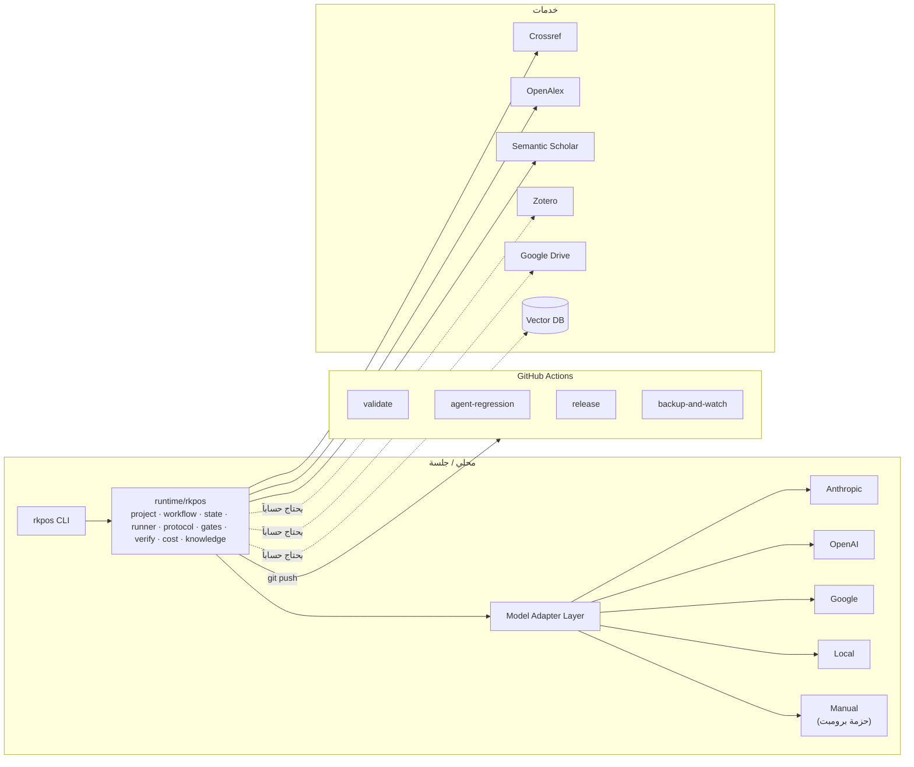

# المرحلة الخامسة — الأتمتة والأمن واستقلال النموذج والاختبار

## ٥.١ معمارية الأتمتة

| المهمة الروتينية | الأتمتة | الحالة |
|---|---|---|
| فحص بنية الملفات | `scripts/check_structure.py` في CI | ✅ |
| فحص Metadata والمخططات | `rkpos validate` + `scripts/validate_projects.py` | ✅ |
| فحص الروابط | `scripts/check_links.py` | ✅ (داخلية) |
| اختبار المخططات | pytest | ✅ |
| Quality Checks على المسودات | `rkpos check-manuscript` | ✅ |
| إنشاء Release | `release.yml` على الوسم | ✅ (يحتاج ضبط الخطوط أول مرة) |
| حفظ النسخ | `backup-and-watch.yml` | ✅ (artifact) |
| بناء PDF/EPUB | `scripts/build_publication.sh` | ✅ (يحتاج Pandoc + XeLaTeX) |
| مزامنة Zotero/Drive | AG-AUT | ⏳ يحتاج حسابات |
| الرصد البحثي المجدول | `WF-RESEARCH-WATCH` | ⏳ Phase 6 |

## ٥.٢ معمارية الأمن

| المبدأ | التطبيق |
|---|---|
| Least Privilege | `memory.yaml` و`tools.yaml` و`permissions.yaml` لكل وكيل؛ `registry.check_integrity` يرفض الانتهاكات البنيوية |
| RBAC | دور لكل وكيل `role:<type>:<slug>`؛ مسارات كتابة مسموحة `write_path_allowlist` |
| إدارة الأسرار | `.env` غير متتبع؛ `.env.example` بلا قيم؛ أسرار CI في GitHub Secrets؛ `scripts/security_scan.py` يفحص المفاتيح |
| حماية مفاتيح API | لا تُطبع ولا تُسجل؛ اختبار T-AUT-01 يرفض طلب طباعتها |
| النسخ الاحتياطي | لقطة أسبوعية + Drive Archive + git |
| التشفير | AUTHOR_ONLY في `memory/author/private/` غير المتتبع؛ يوصى بتشفير القرص/الخزنة؛ اللقطات المؤرشفة تُشفّر قبل الرفع الخارجي |
| التحكم بالإصدارات | git + وسوم + CHANGELOG؛ لا force-push |
| سجلات الوصول | `logs/audit.jsonl` إلحاقي؛ AG-SEC يراجع دورياً (B/C) |
| حقن التعليمات | الدستور C5/C10 + اختبار T-GLB-02: النص المستورد بيانات لا أوامر |

**تصنيف البيانات:** `PUBLIC · INTERNAL · CONFIDENTIAL · AUTHOR_ONLY` — التفاصيل والقيود على الخدمات الخارجية في `governance/data_classification.yaml`.

## ٥.٣ استقلال النموذج وسياسة التوجيه

| الفئة | الاستعمال | الأساسي | البدائل |
|---|---|---|---|
| T1-economy | تنسيق، تصنيف، بيانات وصفية، كلفة، رصد | claude-haiku-5-5 | اقتصادي آخر · محلي |
| T2-standard | تحقق المصادر، الإنتاج، الأرشفة، الأتمتة | claude-sonnet-5-5 | Google · OpenAI |
| T3-advanced | بحث، تحليل، تأليف، تحرير، تنسيق | claude-opus-5-5 | OpenAI · Google |
| T4-independent | تحكيم، فريق أحمر، إشراف، تدقيق | **مزود غير مزود الكتابة** | Google · Anthropic (مع تحذير) |

- تبديل المزود = تعديل `config/model_routing.yaml` فقط.
- `router.resolve` يتخطى للمراجعين أي نموذج من مزود الكتابة؛ إن تعذر يسجل `INDEPENDENCE_DEGRADED`.
- بلا أي مفتاح: الوضع اليدوي (`ManualAdapter`) — المنظومة تعمل دائماً.
- معرّفات النماذج غير Anthropic في ملف التوجيه **أسماء نائبة بأحرف كبيرة** (مثل `ADVANCED_MODEL`) تُستبدل بمعرّفات فعلية عند التفعيل؛ المحوّل يعدّها غير متاحة حتى ذلك.

## ٥.٤ إطار الاختبار (Agent Evaluation & Regression)

| الطبقة | الأداة | متى |
|---|---|---|
| سلامة المنظومة | `rkpos validate` | كل دفع |
| حزم الاختبار (بنيوي) | `rkpos eval` — تغطية إلزامية: hallucination · security · permissions · handoff_quality | كل دفع |
| الوحدات والتكامل | `pytest` (35 اختباراً: سلامة · بروتوكول · مخططات · تحقق · طرف لطرف) | كل دفع |
| الانحدار الحي | `rkpos eval AG-XXX --live` — الوكيل يجيب، ومحكّم T4 مستقل يقيّم `must/must_not` | عند تغيير Prompt/Model (WF-AGENT-CHANGE) |

أبعاد التقييم الثمانية لكل وكيل: Accuracy · Citation Accuracy · Hallucination Rate · Tool Use · Instruction Following · Handoff Quality · Reproducibility · Security Compliance.
عتبة الاعتماد: اجتياز 100% من حالات الحزمة (`pass_threshold` في `tests.yaml`) قبل دمج أي تغيير.
